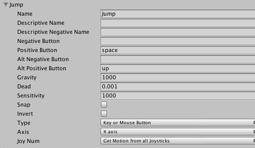

# Input

Kali ini kita akan belajar tentang cara menghandle input dengan menggunakan `Input.GetKey`, `Input.GetButton`, dan `Input.GetAxis`


## Input.GetKey

Yang pertama adalah `Input.GetKey`, dengan menggunakan `Input.GetKey` kita bisa menghandle input secara langsung berdasarkan tombol pada keyboard atau mouse yang ditekan oleh user

Misalnya :

```
if (Input.GetKey(KeyCode.Space)) {
  Jump()
}
```

Pada script diatas kita mendeteksi apakah tombol space (spasi) ditekan atau tidak, apabila ditekan kita akan menjalankan method `Jump()` yang berisi script untuk melakukan aksi lompat, kita bisa mengakses nama dari tombol dengan menggunakan `KeyCode.Space` (untuk spasi), `KeyCode.UpArrow` (untuk arah atas), `KeyCode.A` (untuk tombol A) dan masih banyak lagi

**Untuk lebih jelasnya bisa mengunjungi referensi berikut :**

**Dokumentasi GetKey -** https://docs.unity3d.com/ScriptReference/Input.GetKey.html

**Dokumentasi KeyCode -**
https://docs.unity3d.com/ScriptReference/KeyCode.html

**Tutorial -**
https://unity3d.com/learn/tutorials/topics/scripting/getbutton-and-getkey

## Input.GetButton

Dengan menggunakan `Input.GetButton` kita bisa memberikan label kepada beberapa tombol, sehingga kita bisa menghandle banyak button dalam satu kondisi berdasarkan labelnya

misalnya kita memberi label `Jump` untuk tombol spasi dan up pada keyboard, sehingga :

```
if (Input.GetButton("Jump")) {
  Jump()
}
```

Disini kita mendeteksi apakah button dengan label jump sudah ditekan atau belum, apabila ditekan maka kita akan menjalankan method `Jump()`, mungkin sekilas mirip seperti dengan menggunakan `Input.GetKey` namun akan kelihatan bedanya apabila kita membuka `Input Manager` (Edit - Project Settings - Input)



Disitu bisa kita lihat bahwa label Jump memiliki dua tombol, yaitu space dan up, sehingga kita bisa melakukan `Jump()` dengan menekan tombol space atau up, disini kita juga bisa mengatur agar tombol Jump juga menerima input dari joysticks sehingga pada script yang kita buat kita tidak perlu menghandle banyak tombol, cukup panggil nama tombolnya saja (misalnya Jump) kemudian tinggal diatur di `Input Manager`

**Untuk lebih jelasnya bisa mengunjungi referensi berikut :**

**Dokumentasi GetButton -** https://docs.unity3d.com/ScriptReference/Input.GetButton.html

**Tutorial -**
https://unity3d.com/learn/tutorials/topics/scripting/getbutton-and-getkey

## Input.GetAxis

`Input.GetAxis` konsepnya mirip dengan `Input.GetButton` yaitu dengan memanggil nama labelnya kita bisa menghandle banyak tombol dengan melalui `Input Manager`, namun perbedaannya adalah `Input.GetAxis` tidak mereturn boolean seperti `Input.GetButton` melainkan nilai antara 1 dan -1

Misalnya kita mempunyai axis dengan label horizontal :


Disana kita mengeset left sebagai tombol negatif (bernilai -1) dan right sebagai tombol positif (bernilai 1)

Biasanya `Input.GetAxis` dimanfaatkan untuk menghandle pergerakan game object seperti berikut :

```
void Update() {
  float horizontal = Input.GetAxis("Horizontal");
  transform.Translate(horizontal, 0, 0);
}
```

variabel horizontal akan bernilai 1 apabila kita menekan tombol right dan akan bernilai -1 apabila kita menekan tombol left

**Untuk lebih jelasnya bisa mengunjungi referensi berikut :**

**Dokumentasi GetAxis -** https://docs.unity3d.com/ScriptReference/Input.GetAxis.html

**Tutorial -**
https://unity3d.com/learn/tutorials/topics/scripting/getaxis
