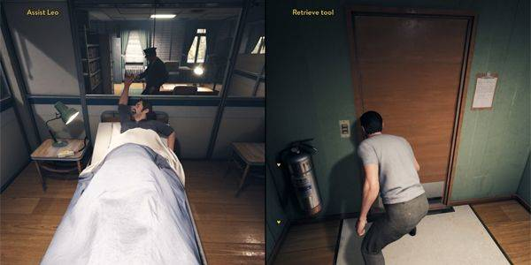

# Konsep Game Multiplayer

Pada game multi player para developer mengguakan split-screen, dan sekarang para developer sudah beralih ke multiplayer online dibandingkan  mode split screen. 

Untungnya,developer nintendo mencoba untuk memopulerkan kembali konsep local multiplayer. Seperti diketahui, Switch memiliki controller unik yang dapat dipakai dua pemain. Jadi kalian gak usah bingung lagi mau bikin game sperti apa.

- Contoh game yang menggunakan split mode

Meski bisa dimainkan online, tapi A Way Out lebih ditujukan untuk dimainkan secara lokal. Game buatan EA ini, menggunakan segala sesuatu yang dapat membuat pengalaman multiplayer split-screen menjadi lebih imersif. Termasuk menggunakan perspektif pergeseran kamera yang tidak hanya memperkuat ikatan antar karakter, tapi juga pemain. Meski secara keseluruhan game ini dapat diselesaikan dalam waktu 8 jam saja, setiap pilihan kecil yang ditemui masing-masing karakter, dipastikan berbeda

- Untuk mengenal lebih jauh tentang konsep multipayer game

```asd
http://www.wisdomofjim.com/multiplayer-games-and-the-concept-of-a-room.html
